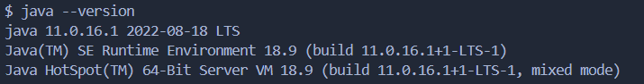
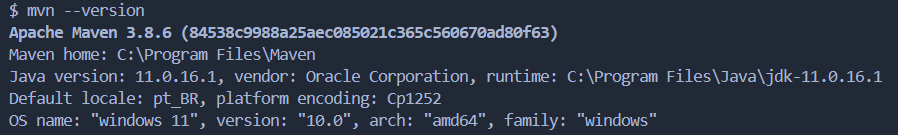
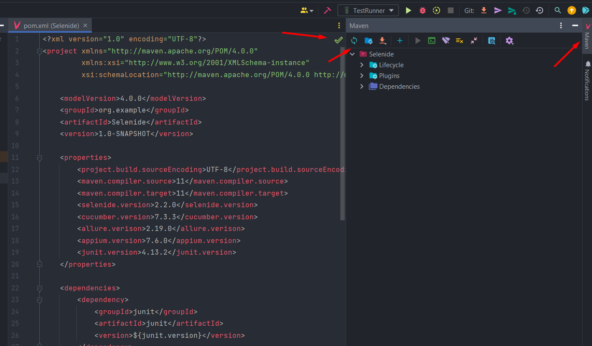
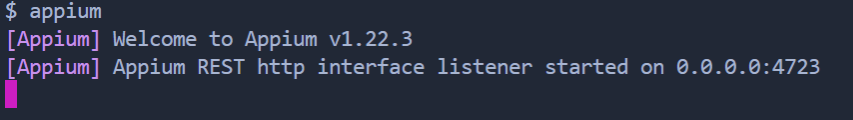
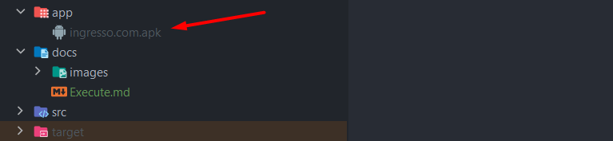
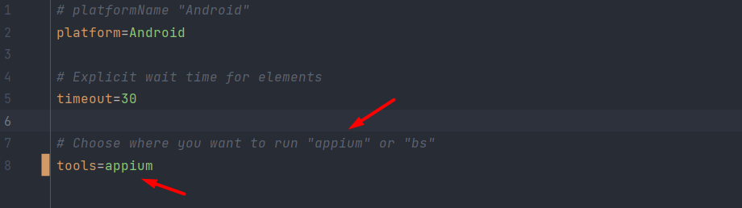
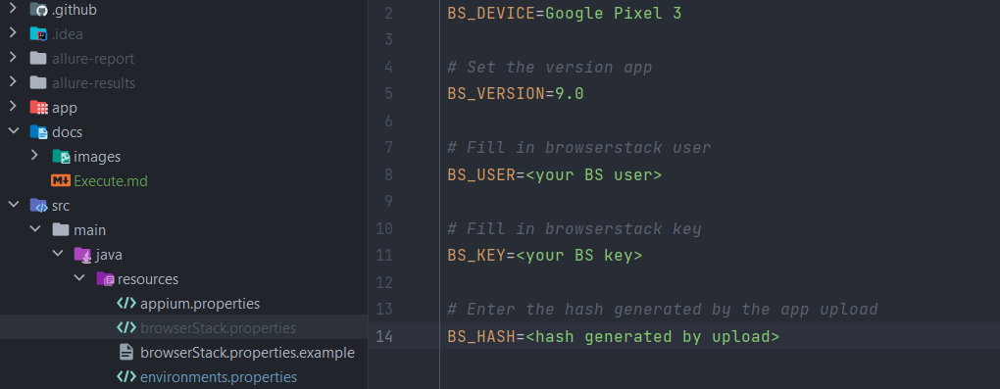
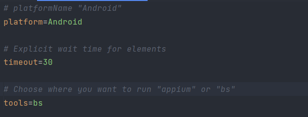

## Execution of the Appium-Selenide-Ingresso.com project

<p>

To run this project you must have the following dependencies:

- <a href="https://git-scm.com/">Git</a> to clone the project on your machine;

- <a href="https://www.java.com/pt-BR/">Java</a> which is the language in which the project was developed;

- <a href="https://maven.apache.org/download.cgi">Maven</a> to run the project via the command line;

- <a href="https://nodejs.org/en/">NodeJS</a> for installing Appium;

- <a href="https://developer.android.com/">Android Studio</a> to emulate devices during test execution;

- <a href="https://www.jetbrains.com/pt-br/idea/download/#section=windows">IntelliJ</a> Text editor to open the project
  and install dependencies (This is my suggestion, but you can use whatever editor you want).

<p>

Download and install JDK in version 11 or higher, and to make sure everything is ok Run the `java--version` command  if 
return to the installed java version then everything is right.

example:



<p>

Then create the JAVA_HOME environment variable (if you don't know how to do it, access this help
<a href="https://medium.com/beelabacademy/configurando-vari%C3%A1veis-de-ambiente-java-home-e-maven-home-no-windows-e-unix-d9461f783c26">
article</a> for this configuration).

<p>

Download the Maven zip file and unzip the "apache-maven-x.x.x-bin" folder, create the MAVEN_HOME environment variable
from the apache folder path, and to make sure it was installed correctly, run `mvn --version`, if it returns the
downloaded version of Maven everything is ok (If you need support to configure MAVEN_HOME, see this
<a href="https://medium.com/beelabacademy/configurando-vari%C3%A1veis-de-ambiente-java-home-e-maven-home-no-windows-e-unix-d9461f783c26">
article</a>).

example:



<p>

Download and install Android studio, after downloading and configuring themes, you need to create emulator.

to create the emulator access the android studio settings in the upper right corner

- Click on AVD Manager in the displayed menu;

- In the list on the left, select "Phone";

- Select a model that contains the Play Store, this to make it easier if you need to download something from the store;

- Select the desired Android version. Newer versions tend to work better.

- Set device name;

- The AVD will create the Emulator and you can launch it by clicking the "Play" button in the "Actions" column.

If you need help creating a device, access this <a href="https://react-native.rocketseat.dev/android/emulador/">
article</a>).

<p>

Installing Android Studio is not enough to fully use the IDE. Therefore, it is necessary to configure the Android SDK by
creating an environment variable called `ANDROID_HOME`.

1. Open the Windows environment variable settings (System or Your Account, whichever you have access to);
2. On the displayed screen, click on _New..._;
3. In the "variable name" field type `ANDROID_HOME`;
4. In the "Value" field, the path mentioned above;
5. Click _Ok_;
6. On the same screen, look for the `PATH` variable and click on _Edit_;
7. Insert a line with the value `%ANDROID_HOME%\tools`;
8. Insert another line with the value `%ANDROID_HOME%\platform-tools`;
9. Click on _Ok_ in the window for the PATH` variable;
10. Click _Ok_ on the environment variables settings window;

Restart your terminal/cmd for the above settings to take effect. (support for
this <a href="https://producaodejogos.com/configurando-o-ambiente-de-desenvolvimento-android/">
configuration</a>).

With git installed on your machine, clone the project by running the command:

```
git clone https://github.com/juliosantosjob/Appium-Selenide.git
```

Download and install Intellij and open the project using the IDE, go to the pom.xml file, click on the maven button to
install the project's dependencies.

example:



<p>

done, the project was successfully installed.

### Running with Appium

With node installed on your machine, run the command `npm install -g appium` in the terminal to install Appium.

After the installation is complete, type the command in the terminal

```
appium
```

With this command, the Appium server will start (to execute this project using APPIUM, it is necessary that the 
server is always active during execution).

example:



<p>

Download the project apk by accessing
this <a href="https://apkcombo.com/pt/ingresso-com-filmes-cinema/com.ingresso.cinemas/download/apk">
link</a>.

rename the apk to "ingresso.com.apk" create a folder called "app" in the root of the project and add the apk inside it

example:



<p>

access the path "src/main/java/resources/environments.properties" and in front of the key "tools" pass the value "
appium"

example:



<p>

With the emulator and the appium up, run the command in the project's terminal

```
mvn test
```

Thus the tests will be executed using the Appium.
  
### Running with BrowserStack

to run the tests pointing to the Browserstack access the path "src/main/java/resources" and create a file with the
name "browserStack.properties" you can use the file "browserStack.properties.example" to reference.

example:



<p>

in this new file created, passes in front of the keys

1. BS_USER=your browserstack user;
2. BS_KEY=or your browserstack password;
3. BS_HASH=the hash generated by the browserstack after uploading the apk;
  
(These sensitive data were kept as Secrets in Github).

access the path "src/main/java/resources/environments.properties" and in front of the key "tools" pass the value "bs"

example:



<p>

Now just run the project by running the command in the terminal

```
mvn test
```